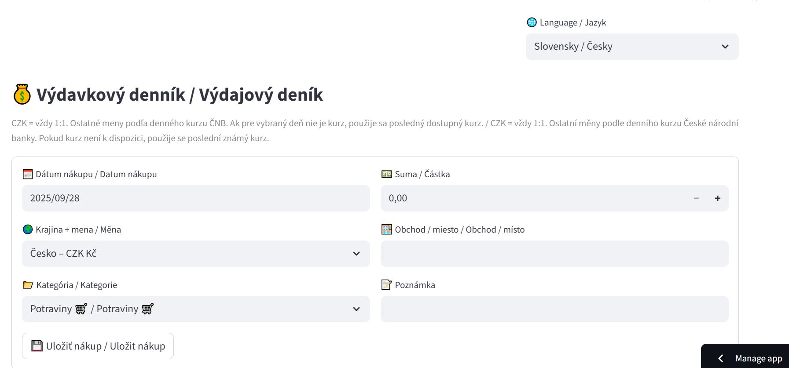
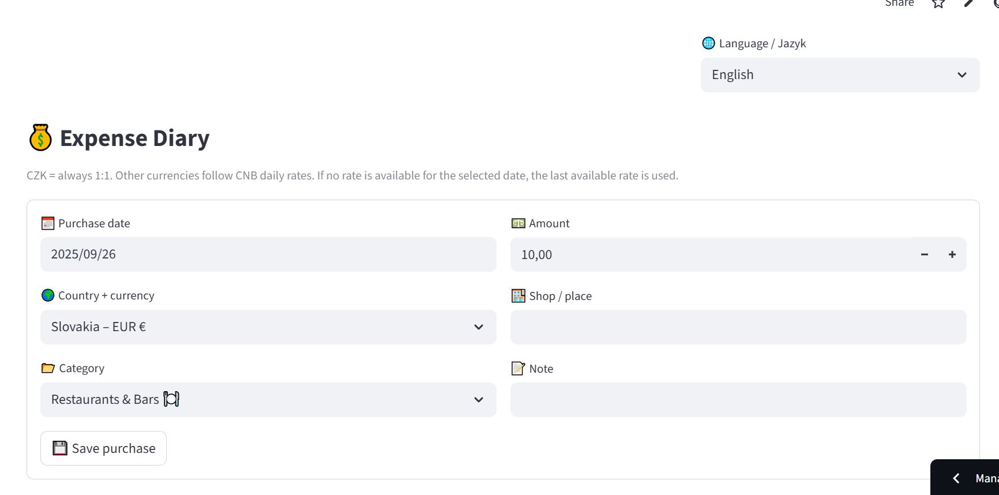

# 🧾 Food Expenses App / Výdavkový denník

Bilingual expenses app (CZK base currency, CNB daily rates) built with **Streamlit**.  
Plne funkčná aplikácia na správu výdavkov s podporou viacerých mien, grafmi a exportom dát.  

👉 [**Spustiť aplikáciu online**](https://food-expenses-app-phgvzfp3bej2cnnnujlmvm.streamlit.app/)  

📱 QR kód pre rýchle spustenie:  

---

## ✨ Funkcie
- **Bilingválna aplikácia (čeština / angličtina)**  
- **Podpora viacerých mien** – automatický prepočet na CZK podľa denných kurzov ČNB  
- **Fallback mechanizmus** – ak kurz nie je dostupný, použije sa posledný známy  
- **Kategórie s ikonami / piktogramami** (potraviny, doprava, drogérie, reštaurácie & bary, zdravie, zábava…)  
- **Prehľadné tabuľky** všetkých nákupov s detailami (dátum, krajina, mena, kurz, kategória, poznámka)  
- **Grafy výdavkov podľa kategórií**  
- **Export do CSV** pre ďalšiu analýzu  

---

## 🖼 Screenshoty
### CZ verzia

### EN verzia

---

## 📌 Aktuálny stav
✅ Funkčná aplikácia – testovaná na viacerých zariadeniach (Huawei, Samsung, iPhone, Lenovo notebook)  
✅ Testované aj mimo ČR (Slovensko, Nemecko)  
✅ Stabilný prepočet mien + grafy + export  

🚧 **UX/UI dizajn** – vo vývoji (plánovaný originálny vizuál vo forme *„výťahu“*)  

---
📌 Verzie aplikácie
- **CNB_test_app.py** – hlavná a aktuálna verzia (bilingválna, API ČNB, grafy, kategórie, export, plne funkčná ✅)  
- **app.py a ENG_app.py** – staršie verzie (prototypy bez plnej funkcionality, ponechané pre dokumentáciu vývoja)

---

## 🛠️ Použité technológie
- Python  
- Streamlit  
- Pandas  
- Requests (API – denné kurzy ČNB)  

---

## 📚 Využité znalosti a kurzy
Táto aplikácia nevznikla náhodou – je výsledkom kombinácie mojej práce, testovania a poznatkov, ktoré som získala v rámci niekoľkých vzdelávacích kurzov:

- **Python for Everybody (University of Michigan, Coursera)** – zvládnutie základov a pokročilejších techník Pythonu, práca s dátami, API a regulárnymi výrazmi.  
- **DaPython (PyLadies)** – praktické cvičenia a projekty v Pythone, vrátane práce s pandas a vizualizáciami.  
- **UX/UI Design (California Institute of the Arts, Coursera)** – návrh užívateľského rozhrania, prístupnosť, vizuálne prvky a tvorba intuitívnych dizajnov.  
- **Generative AI Data Analyst Specialization (Vanderbilt University)** – využitie AI v dátovej analytike, prompt engineering a efektívna práca s nástrojmi ako ChatGPT.  

👉 Všetky tieto kurzy mi pomohli poskladať appku krok za krokom – od návrhu, cez písanie a ladenie kódu, až po UX/UI dizajn a testovanie na viacerých zariadeniach a v rôznych krajinách.  

---

## ⚖️ Licencia
Tento projekt je publikovaný pod licenciou **MIT**.  
Viď [LICENCE](LICENCE).  

---

👩‍💻 Autor: **Denisa Pitnerová (2025)**
