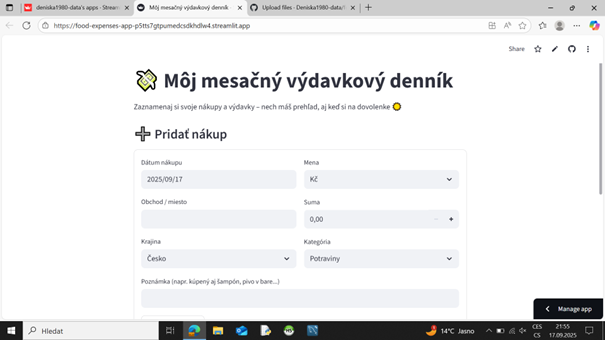

# 🛒 Food Expenses App 

## 🇬🇧 English
A simple food expenses tracking app built with **Streamlit**.  
It helps users log, analyze and visualize their daily expenses (food, groceries, entertainment, etc.).  
The app supports multiple currencies and automatic conversion to CZK.  

### 🚀 Live Demo

👉 [Open the app on Streamlit Cloud](https://food-expenses-app-p5tts7gtpumedcsdkhdlw4.streamlit.app/#moj-mesacny-vydavkovy-dennik)

### 📌 Status
- App is still under development and testing (work in progress).  
- During early setup there were some issues:  
  - accidentally mixed code with Google Colab format,  
  - problems deploying from GitHub to Streamlit,  
  - wrong demo link.  
- All errors were fixed and the Live Demo is now running.  
- Further development and improvements are in progress.
- 
### 📌 Code Sample - Python
import streamlit as st
import pandas as pd

st.title("Moj mesačný výdavkový denník")
df=pd.read_csv("expenses.csv")
st.dataframe(df.head())

Created by / Vytvořeno: **Denisa (2025)**
