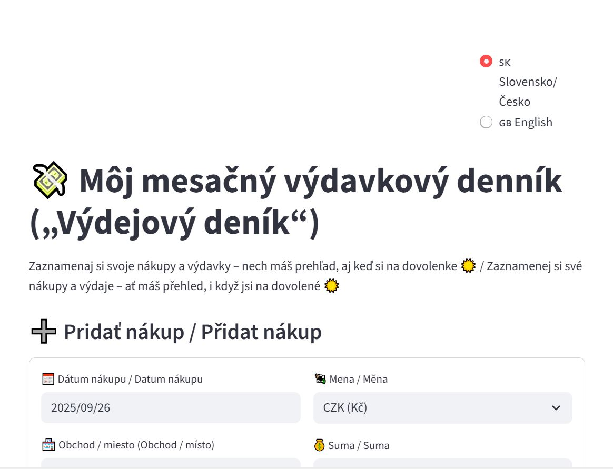

# 💸 Food Expenses App / Výdavkový denník („Výdejový deník“)

📌 [Open the app on Streamlit](https://food-expenses-app-p5tts7gtpumedcsdkhdlw4.streamlit.app)

---
## 🇬🇧 English

### 📌 About the project
A simple bilingual **expenses tracker prototype** built with **Streamlit**.  
It helps users **log, analyze and visualize** their daily expenses.  

⚠️ **Note:** This app is still **in development** – it is currently a **prototype**.  
Only a few basic categories are included for now to test functionality.  
More categories, features and the final design (elevator-style) will be added step by step.  

- Two language versions: **Slovak/Czech** and **English**  
- Currency conversion (**CZK** as base)  
- Categories visualized as **elevator floors with pictograms and text labels**  
- Friendly and playful UI for children, adults, seniors, and **accessible for visually impaired users**  

### 🛠️ Development notes
This prototype was **tested for functionality** and continuously improved:  
- ✅ Fixed error messages  
- ✅ Added dual-language labels (Slovak + Czech)  
- ✅ Retested the app after every change  
- ✅ Prototype tested on multiple devices (mobile + notebook)  
- ✅ Shared app link – confirmed working by other users  
- ✅ First positive user feedback received  

## ✨ Features / Funkcie

- **🔮 Automatic exchange rates from ČNB** – currently fixed rates  
  (25 CZK = 1 EUR, 20 CZK = 1 USD, 30 CZK = 1 GBP),  
  but planned connection to live ČNB API.  

- **🚀 Elevator-style visualization** – each category is one “floor”.  
  The user chooses what they want to see,  
  and the app “takes them to that floor” → playful, intuitive and unique design.  

- **🏢 Example of categories by floors (with pictograms + names in brackets):**
  - 🥖🧴 **0. floor: (Food + Drugstore / Potraviny + Drogérie)**  
  - 👗 **1. floor: (Clothing / Oblečenie)**  
  - 👟 **2. floor: (Shoes / Obuv)**  
  - 💄 **3. floor: (Cosmetics / Kozmetika)**  
  - ✂️ **4. floor: (Hairdresser / Kaderníctvo)**  
  - 🍽️ **5. floor: (Restaurants & Bars / Reštaurácie a bary)**  
  - 🎭 **6. floor: (Entertainment / Zábava)**  
  - 🧹 **7. floor: (Cleaning / Čistiarne, Upratovanie)**  
  - 🛠️ **8. floor: (Repairs / Opravovne, Servisy)**  
  - 💡 **9. floor: (Other expenses / Ostatné výdavky)**  

- **🎨 Better UI/UX styling** – adapting colors, backgrounds and font sizes  
  for all age groups (kids, adults, seniors).  

- **📱 Accessibility for everyone** – playful design, clear layout, bigger fonts,  
  contrast colors and readable text in brackets for screen readers (for visually impaired users).  

- **🖼️ Icons and pictograms** – each category uses an emoji/pictogram,  
  so even users who don’t read category names can recognize it quickly.  

---

## 🖼 Screenshots  
> Note: Screenshots are illustrative / Obrázky sú ilustračné  
<td align="center"> SK Slovak / CZ Czech version<br><br>

</td>
<table>
<tr>

### 🚀 How to run locally
1. Clone this repository
git clone https://github.com/Deniska1980-data/food-expenses-app.git
cd food-expenses-app
2. Install requirements
pip install -r requirements.txt
3. Run Streamlit app
streamlit run app.py

### 🧑‍💻 Example code snippet
```python
import streamlit as st
import pandas as pd
from datetime import date as dt_date

---

### 🇸🇰 Slovenská / CZ Česká verzia
📌 O projekte

Jednoduchý dvojjazyčný prototyp na sledovanie výdavkov vytvorený v Streamlite.
Pomáha používateľom zaznamenávať, analyzovať a vizualizovať svoje denné výdavky.

⚠️ Upozornenie: Aplikácia je stále vo vývoji – zatiaľ ide o prototyp.
Zahrnuté sú iba základné kategórie na testovanie funkčnosti.
Ďalšie kategórie, funkcie a finálny dizajn (výťahové poschodia) budú doplnené postupne.

Dve jazykové verzie: slovenská/česká a anglická

Prepočítavanie mien (základná mena CZK)

Kategórie budú vizualizované ako poschodia výťahu s piktogramami a názvami v zátvorke

Veselé a hravé prostredie vhodné aj pre deti či starších používateľov

Appka bude čitateľná aj pre slabozrakých a nevidiacich (čítačky textu prečítajú názvy v zátvorkách)

🛠️ Poznámky k vývoju
Tento prototyp bol testovaný z hľadiska funkčnosti a postupne vylepšovaný:

✅ Doplnila som dvojjazyčné názvy (slovenské/české) + anglickú verziu
✅ Opravila som chybové hlášky
✅ Po každej úprave som aplikáciu znovu testovala
✅ Prototyp testovaný na viacerých zariadeniach (mobil + notebook)
✅ Zdieľaný odkaz – potvrdené, že appka funguje aj u iných používateľov
✅ Prvá pozitívna spätná väzba od používateľov

### 🧑‍💻 Ukážka kódu
import streamlit as st
import pandas as pd
from datetime import date as dt_date

###🔮 Planned features / Plánované funkcie

Automatic exchange rates update from Czech National Bank (ČNB) API
More categories and subcategories for expenses
Export to Excel/CSV
Simple charts and visualizations directly in the app
Elevator-style graphics for category navigation
Icons and emojis for easy recognition across age groups
Accessibility improvements for screen readers and high-contrast themes

### 🚀 Ako spustiť lokálne
1. Naklonuj si repozitár
git clone https://github.com/Deniska1980-data/food-expenses-app.git
cd food-expenses-app
2. Nainštaluj balíčky
pip install -r requirements.txt
3. Spusti aplikáciu
streamlit run app.py

### 📅 Metadata
Date / Dátum: 09/2025
Author / Autor: Denisa Pitnerová
